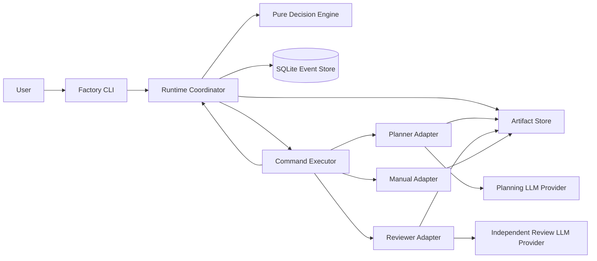
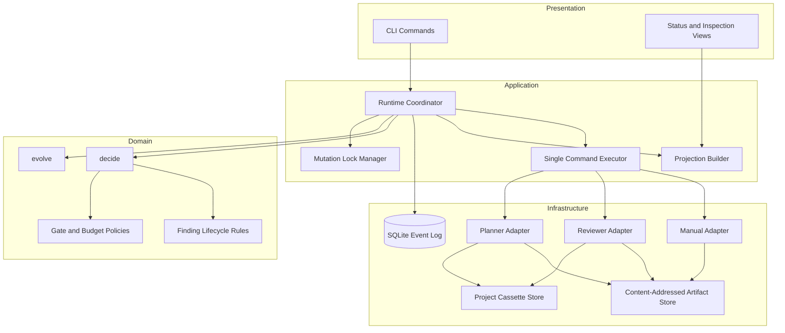
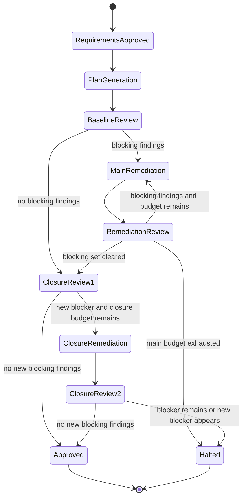
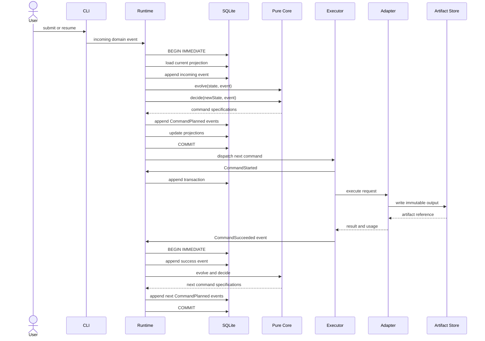

# Software Factory Architecture — Milestone 1

**Status:** Draft — under design review
**Architecture version:** 1.0
**Input:** Software Factory PRD v1.0
**Scope:** Requirements-to-approved-plan walking skeleton
**Deployment model:** Local, single-user command-line application
**Implementation status:** Not started

<!-- sf:section-id=ARCH-OVERVIEW-001 -->
## 1. Executive Summary

The software factory will initially be a local TypeScript command-line application that automates the workflow from an approved requirements ledger to an approved implementation plan.

The system will:

1. Accept raw requirements and a manually submitted requirements ledger.
2. Generate a structured implementation plan through an LLM adapter.
3. Render that structured plan as anchored Markdown.
4. Perform an independent baseline review.
5. Maintain an orchestrator-owned findings ledger.
6. Run bounded remediation and closure-review cycles.
7. Preserve every meaningful state transition in an append-only event log.
8. Survive process termination and resume without losing decisions, findings, or artifacts.
9. Record provider interactions behind a replayable adapter boundary.
10. Halt with an evidence-rich report when approval cannot be reached within configured budgets.

Milestone 1 will not include architecture generation, GitHub issue creation, Cursor integration, code generation, deployment, a web application, or a remote server.

The central architectural rule is:

> The decision engine decides what should happen. Adapters perform effects. The event log records what happened.

<!-- sf:section-id=ARCH-DRIVERS-001 -->
## 2. Architecture Drivers

### 2.1 Primary quality attributes

| Attribute | Required behavior |
|---|---|
| Recoverability | The system can be terminated and restarted between commands without losing state or duplicating completed work. |
| Determinism | Replaying the same event log under the same engine version reconstructs the same state and command specifications. |
| Traceability | Requirements, plan sections, findings, review observations, and approvals remain linked through stable identities. |
| Explainability | Every pass, failure, retry, invalidation, reclassification, and halt has recorded evidence. |
| Bounded execution | Review cycles, schema repairs, provider calls, token use, and cost are limited by configuration. |
| Provider isolation | LLM providers are accessed only through adapters and may be replaced without changing workflow semantics. |
| Privacy | Proprietary requirements, prompts, responses, and cassettes remain project-local by default. |
| Simplicity | Milestone 1 runs locally, processes one command at a time, and uses no distributed infrastructure. |

### 2.2 Architectural constraints

- TypeScript on Node.js
- Local CLI interface
- SQLite database
- One project per factory workspace
- One active mutating process per project
- One in-flight effectful command
- Append-only event history
- Structured JSON as the canonical machine representation
- Markdown as a rendered, human-editable projection
- Exact model snapshots where providers expose them
- No floating provider aliases in reproducible runs
- No background server
- No web interface
- No deployment platform
- No generalized workflow language in Milestone 1

<!-- sf:section-id=ARCH-SCOPE-001 -->
## 3. Scope and Non-Goals

### 3.1 Milestone 1 workflow

```text
Raw requirements
    ↓
Manual requirements ledger submission
    ↓
Requirements approval
    ↓
Structured plan generation
    ↓
Anchored Markdown rendering
    ↓
Baseline plan review
    ↓
Findings ledger
    ↓
Bounded remediation loop
    ↓
Bounded closure loop
    ↓
Approved plan or halt report
```

### 3.2 Included

- Project initialization
- Raw requirements artifact registration
- Manual requirements ledger submission
- Requirements approval
- Plan generation
- Stable plan-section identity
- Baseline review
- Findings and observations
- Remediation claims
- Diff-based remediation review
- Full-document closure review
- Retry and budget handling
- Artifact provenance
- Crash-safe state persistence
- Strict replay seam
- Human approval
- Run inspection
- Halt reporting

### 3.3 Explicitly excluded

- Automated requirements normalization
- Architecture generation
- Ticket generation
- GitHub publishing
- Cursor skill execution
- Claude Code or Codex implementation
- Repository modification
- Test execution against a product codebase
- Generalized artifact dependency graphs
- Cross-run memoization
- Parallel command execution
- Multi-user support
- Cloud hosting
- Web dashboards
- Workflow plug-in marketplaces

<!-- sf:section-id=ARCH-CONTEXT-001 -->
## 4. System Context



### 4.1 User

The user supplies requirements, approves normalization, inspects findings, submits manual artifacts, requests retries, and approves or rejects the final plan.

### 4.2 Factory CLI

The CLI is the only user interface in Milestone 1. It translates user actions into domain events and displays projections derived from the event log.

### 4.3 Runtime coordinator

The runtime coordinator owns transaction boundaries, event persistence, state reconstruction, command dispatch, locks, and adapter invocation.

It does not contain review policy or workflow decisions.

### 4.4 Pure decision engine

The decision engine contains workflow rules and state transitions. It does not access the filesystem, database, clock, environment, network, or random-number generator.

### 4.5 Command executor

The executor selects one planned command, records its execution state, invokes the correct adapter, and submits the resulting event to the runtime coordinator.

### 4.6 Adapters

Adapters perform external or nondeterministic work:

- Planner LLM calls
- Reviewer LLM calls
- Manual user submissions
- Artifact reads and writes
- Clock and usage capture
- Provider-response recording

<!-- sf:section-id=ARCH-PRINCIPLES-001 -->
## 5. Core Architecture Principles

### 5.1 Pure decisions, isolated effects

The core APIs are conceptually:

```ts
evolve(state, event): State
decide(state, event): CommandSpec[]
```

Neither function performs effects.

The runtime executes the commands and returns their outcomes as new events.

### 5.2 Events are the source of truth

The append-only event log is authoritative.

Tables representing current runs, findings, commands, or artifacts are projections. They may be rebuilt from the event stream.

### 5.3 Artifacts are immutable versions

An artifact version is never overwritten. A human edit, model revision, or regenerated document produces a new artifact version with a new content hash.

### 5.4 Stable identities outlive wording

Requirement IDs, section IDs, component IDs, finding IDs, command keys, and artifact identities are not derived directly from mutable prose.

### 5.5 Review authority is separated

- The planner proposes remediations.
- The reviewer verifies remediations.
- The orchestrator owns finding identity and status.
- The human owns waivers and exceptional reclassifications.

### 5.6 Execution is bounded

Every loop and provider interaction has a declared budget. Exhaustion produces a halt event and report rather than an indefinite retry.

<!-- sf:section-id=ARCH-RUNTIME-001 -->
## 6. Runtime Component Model



### 6.1 Domain layer

Contains:

- Run state
- Event types
- Command types
- Requirement lineage rules
- Section continuity rules
- Finding lifecycle rules
- Review budgets
- Gate policies
- Invalidation rules

### 6.2 Application layer

Contains:

- Transactional event append
- Command scheduling
- Single-command execution
- Lock management
- Projection updates
- Resume and reconciliation
- CLI use cases

### 6.3 Infrastructure layer

Contains:

- SQLite implementation
- Filesystem artifact implementation
- LLM provider clients
- Cassette record/replay implementation
- Manual submission implementation
- System clock and usage capture

Dependencies point inward. The domain layer does not import infrastructure code.

<!-- sf:section-id=ARCH-EVENTS-001 -->
## 7. Event-Sourced State Model

### 7.1 Event envelope

Every event uses a versioned envelope:

```ts
interface EventEnvelope<TPayload> {
  runId: string;
  sequence: number;

  eventType: string;
  schemaVersion: number;

  recordedAt: string;
  producer: string;
  engineVersion: string;

  causationId?: string;
  correlationId?: string;

  payload: TPayload;
}
```

### 7.2 Sources of nondeterminism

The pure core must not generate:

- Timestamps
- Random IDs
- Provider request IDs
- Token counts
- Cost calculations based on live pricing
- Filesystem paths based on current time
- Environment-dependent values

Such values are produced by adapters or the event store and persisted in event payloads.

Deterministic domain identifiers may be derived from persisted state. Examples include sequential finding IDs such as `F-0007` and plan-section IDs such as `PLAN-0012`.

### 7.3 Event schema versions

Every event type has an independent schema version.

Old events are converted into current in-memory representations through pure upcasters:

```text
Event v1
    ↓
Upcaster v1 → v2
    ↓
Event v2
    ↓
Current domain representation
```

Policy:

- Raw historical events are never mutated.
- Safe additive and representational changes receive upcasters.
- Runs lacking a complete upcast path become read-only.
- Read-only runs remain inspectable and exportable.
- Resumption is permitted only when every event can be interpreted safely.
- Replay fixtures identify the engine version they target.

### 7.4 Primary event families

```text
RunStarted
RunHalted
RunCompleted

RawRequirementsRegistered
RequirementsLedgerSubmitted
RequirementsApproved
RequirementsRejected
RequirementLineageDeclared

CommandPlanned
CommandStarted
CommandSucceeded
CommandFailed
CommandReconciliationRequested
ForceRetryRequested
CacheBypassed

ArtifactRegistered
ArtifactExternallyModified
ArtifactInvalidated

PlanGenerated
PlanRevised
PlanAnchorMapRegistered

BaselineReviewCompleted
RemediationSubmitted
RemediationReviewCompleted
ClosureReviewCompleted

FindingOpened
FindingStatusChanged
FindingReclassified
FindingRequirementRemapped
FindingOrphaned
FindingWaived

ApprovalRequested
ApprovalGranted
ApprovalRejected

ProviderUsageRecorded
BudgetReserved
BudgetReleased
BudgetExceeded
```

<!-- sf:section-id=ARCH-TRANSACTION-001 -->
## 8. Transactional Append-and-Plan Protocol

The triggering event and every `CommandPlanned` event produced from it must be persisted in one SQLite transaction.

This closes the crash window in which an event could be recorded but the decisions caused by that event could be lost.

### 8.1 Transaction algorithm

```text
Acquire mutation lock
    ↓
BEGIN IMMEDIATE
    ↓
Load state through current event sequence
    ↓
Validate incoming event
    ↓
Append incoming event
    ↓
Apply evolve
    ↓
Call decide
    ↓
Append all resulting CommandPlanned events
    ↓
Update projections
    ↓
COMMIT
    ↓
Release database transaction
```

No provider call, filesystem write, or long-running operation occurs inside the SQLite transaction.

### 8.2 Crash outcomes

#### Crash before commit

Neither the triggering event nor its planned commands exist.

The operation may be safely resubmitted.

#### Crash after commit

The triggering event and all commands it caused exist.

On resume, the executor locates the pending command and continues.

#### Crash during an adapter call

The command is already recorded as started. Resume applies the adapter-specific reconciliation policy.

For Milestone 1 LLM calls, a lost response may require a repeated provider call. That repeated physical attempt remains associated with the same logical command and is visible in the event history.

### 8.3 Command identity

The deterministic logical command key is derived from:

```text
Run ID
Triggering event sequence
Command type
Command ordinal
Input digest
```

Conceptually:

```text
commandKey = hash(
  runId,
  triggeringEventSequence,
  commandType,
  commandOrdinal,
  inputDigest
)
```

Because triggering events and planned commands are transactionally appended, the command key is defense-in-depth rather than the primary crash-safety mechanism.

Its principal uses are:

- External idempotency markers
- Provider idempotency keys when supported
- Duplicate-command detection
- Replay-test assertions
- Correlating multiple physical attempts with one logical command

<!-- sf:section-id=ARCH-LOCKING-001 -->
## 9. Concurrency and Locking

### 9.1 One mutating process

Milestone 1 permits one mutating CLI process per project.

Mutating commands include:

- `start`
- `submit`
- `approve`
- `reject`
- `resume`
- `retry`
- `cancel`

A project-level advisory lock prevents a second mutating process from operating on the same event store.

### 9.2 Read operations remain available

Read-only commands do not acquire the mutation lock:

- `status`
- `inspect`
- `events`
- `artifacts`
- `findings`

SQLite runs in write-ahead logging mode so readers can inspect committed state while a long provider operation is in progress.

The mutation lock may remain held by the active executor, but it does not prevent read-only database connections.

### 9.3 One in-flight command

Only one effectful command may have `started` status at a time.

This keeps the event stream linearly ordered and avoids concurrency semantics that are unnecessary for the first workflow.

<!-- sf:section-id=ARCH-ARTIFACTS-001 -->
## 10. Artifact Architecture

### 10.1 Canonical and rendered artifacts

Machine-readable structured artifacts are canonical.

Markdown is a human-readable projection.

Examples:

```text
requirements-ledger.json  → canonical
requirements.md           → source

plan.json                  → canonical
plan.md                    → rendered projection

review-result.json         → canonical
review-report.md           → rendered projection

findings-ledger.json       → exported projection
halt-report.json           → canonical
halt-report.md             → rendered projection
```

### 10.2 Artifact metadata

Every artifact version records:

```ts
interface ArtifactRecord {
  artifactId: string;
  artifactType: string;
  schemaVersion: number;

  contentHash: string;
  byteLength: number;

  origin: "human" | "model" | "deterministic-tool";
  producer: string;

  inputArtifactIds: string[];
  inputHashes: string[];

  promptHash?: string;
  rubricHash?: string;
  modelSnapshot?: string;
  workerVersion?: string;

  createdByEventSequence: number;
  canonicalPath?: string;
}
```

### 10.3 Content-addressed storage

Immutable copies are stored by content hash:

```text
.factory/
├── state.db
├── objects/
│   └── sha256/
│       └── ab/
│           └── abcdef...
├── cassettes/
├── locks/
└── exports/
```

Human-facing projections are stored separately:

```text
docs/
└── factory/
    ├── raw-requirements.md
    ├── requirements-ledger.json
    ├── plan.json
    ├── plan.md
    ├── findings-ledger.json
    ├── review-report.md
    └── halt-report.md
```

### 10.4 Human edits

Before proceeding, the runtime hashes canonical working files.

When a file differs from its registered hash:

1. Append `ArtifactExternallyModified`.
2. Register the edited content as a new artifact version.
3. Mark its origin as `human`.
4. Apply the hardcoded Milestone 1 invalidation rules.
5. Preserve all historical artifact versions.
6. Reconcile the findings ledger rather than deleting it.

<!-- sf:section-id=ARCH-REQUIREMENTS-001 -->
## 11. Requirement Identity and Lineage

### 11.1 Raw requirements remain immutable source material

The factory never replaces the original requirements document.

It stores:

```text
raw-requirements.md
requirements-ledger.json
```

### 11.2 Requirement identity

Each requirement contains:

```ts
interface Requirement {
  id: string;
  displayId: string;

  statement: string;
  status: "active" | "removed" | "superseded";

  sourceArtifactId: string;
  sourceRanges: SourceRange[];

  lineageRootIds: string[];
}
```

Milestone 1 uses a manual adapter: the user authors or reviews the requirement ledger and submits it through the CLI.

### 11.3 Requirement lineage

The protocol supports:

```text
updated
removed
replaced
split
merged
```

A split successor inherits its predecessor’s lineage roots.

A merged requirement inherits the union of all predecessor roots.

Lineage roots are used when computing semantic finding identity, allowing findings to survive requirement splits and merges.

### 11.4 Approval gate

Requirements approval requires:

- Valid schema
- Unique active requirement IDs
- No reused retired IDs
- Every active requirement has source support
- Every relevant source span is mapped or explicitly excluded
- Human approval is recorded

Automated normalization and polished split/merge UX are deferred.

<!-- sf:section-id=ARCH-PLAN-001 -->
## 12. Structured Plan and Stable Section Identity

### 12.1 Canonical plan representation

The planner returns structured data, not free-form Markdown:

```ts
interface PlanDocument {
  schemaVersion: number;
  title: string;
  summary: string;

  componentRegistry: ComponentDefinition[];
  sections: PlanSection[];

  continuityIntents?: SectionContinuityIntent[];
}
```

```ts
interface PlanSection {
  sectionId?: string;
  sectionType: string;
  title: string;
  body: string;

  requirementIds: string[];
  componentIds: string[];
}
```

### 12.2 Permanent IDs are orchestrator-owned

The model does not mint permanent section IDs.

For a new plan:

1. The planner returns structured sections.
2. The orchestrator validates the schema.
3. The orchestrator assigns permanent IDs.
4. The renderer produces anchored Markdown.

For a revision:

1. Existing section IDs are included in the planner input.
2. The planner returns sections using those IDs where continuity exists.
3. Structural changes are represented as explicit continuity intents.
4. The orchestrator validates the intents.
5. The orchestrator assigns IDs to genuinely new sections.
6. The renderer regenerates Markdown.

### 12.3 Markdown rendering

The orchestrator inserts markers:

```md
<!-- sf:section-id=PLAN-DATA-003 -->
## Data Model
```

The model is never responsible for preserving HTML comments during prose rewrites.

### 12.4 Human Markdown edits

Human-edited Markdown is parsed through its markers.

- Preserved markers retain identity.
- A missing marker does not automatically retire a section.
- It creates a `retirement_pending_reconciliation` condition.
- The user or a validated continuity intent resolves that condition.
- A retired ID is never reused.

### 12.5 Anchor continuity gate

The deterministic gate verifies:

- Every previous section ID has exactly one declared outcome.
- Every preserved ID occurs exactly once.
- Every new section receives a previously unused ID.
- Retired IDs do not reappear.
- Split and merge references are valid.
- Finding observations do not silently point to nonexistent sections.
- Section-title changes do not change identity.

<!-- sf:section-id=ARCH-COMPONENTS-001 -->
## 13. Component Registry

Finding identity must not depend on reviewer-authored component names.

The plan contains a small component registry:

```ts
interface ComponentDefinition {
  componentId: string;
  displayName: string;
  status: "active" | "retired";
}
```

Reserved entries include:

```text
SYSTEM
CROSS_CUTTING
PROCESS
```

The reviewer selects component IDs from this registry.

Component display names may change without changing component identity. Retired component IDs are never reused.

The component registry is intentionally small in Milestone 1. It is not a full system-architecture model.

<!-- sf:section-id=ARCH-FINDINGS-001 -->
## 14. Findings Ledger Architecture

### 14.1 Finding and observation separation

A finding represents the persistent semantic concern.

An observation records how that concern appeared in one review against one artifact version.

```ts
interface Finding {
  findingId: string;

  ruleId: string;
  categoryId: string;
  componentId: string;

  semanticFingerprint: string;

  severityAtDiscovery: Severity;
  effectiveSeverity: Severity;

  status:
    | "open"
    | "remediation_submitted"
    | "verified_resolved"
    | "superseded_pending"
    | "reopened"
    | "orphaned"
    | "waived"
    | "retired_not_applicable";

  firstSeenCycle: number;
  lastReviewedCycle: number;
}
```

```ts
interface FindingObservation {
  findingId: string;
  artifactId: string;
  reviewCycle: number;

  requirementIds: string[];
  sectionIds: string[];

  description: string;
  evidence: string;
  recommendation?: string;

  verdict:
    | "new"
    | "still_open"
    | "remediation_accepted"
    | "remediation_rejected"
    | "recurred"
    | "not_applicable";
}
```

### 14.2 Controlled fingerprint inputs

The reviewer never emits a fingerprint.

The orchestrator computes it from controlled fields:

```text
Review-taxonomy version
Rule ID
Taxonomy-derived category ID
Stable component ID
Canonical requirement-lineage roots
```

Conceptually:

```text
fingerprint = hash(
  taxonomyVersion,
  ruleId,
  categoryId,
  componentId,
  sorted(canonicalRequirementRootIds)
)
```

The review taxonomy must define rules narrowly enough that one fingerprint represents one semantic concern class. Multiple manifestations of that concern become observations on the same finding.

Free-text descriptions, titles, anchors, and reviewer-authored component labels are excluded from identity.

### 14.3 Finding authority

The planner may:

- Submit a remediation
- Cite changed sections
- Explain the intended correction

The planner may not:

- Mark a finding resolved
- Change severity
- Retire a finding
- Change finding identity

The reviewer may:

- Verify a remediation
- Reject a remediation
- Reopen a concern
- Propose a severity reclassification
- Identify a new concern

The human may:

- Accept or reject a reclassification
- Waive a finding
- Resolve an orphaned finding
- Mark a finding no longer applicable

The orchestrator applies every transition and records it as an event.

### 14.4 Severity drift

`severityAtDiscovery` is immutable.

A proposed downgrade creates a separate reclassification event with justification. It does not affect gate behavior until accepted by the configured authority.

### 14.5 Plan regeneration

When a plan is regenerated rather than revised:

- Open findings become `superseded_pending`.
- Resolved findings remain resolved but enter a recurrence watchlist.
- Historical observations remain unchanged.
- The next baseline review reconciles every `superseded_pending` finding.
- Semantic fingerprint matching surfaces recurring concerns across generations.

### 14.6 Requirement changes

Finding-to-requirement links are remapped mechanically through the requirement-lineage graph.

A finding whose requirements are removed without successors becomes `orphaned`.

An orphaned critical or high finding blocks approval until a human maps, waives, or retires it.

<!-- sf:section-id=ARCH-REVIEW-001 -->
## 15. Review Protocol



### 15.1 Baseline review

The baseline reviewer receives:

- Requirements ledger
- Complete structured plan
- Rendered plan
- Review taxonomy
- Component registry
- Prior recurrence context, when applicable

It returns:

- Reconciliation for every prior unresolved finding
- New finding proposals using controlled rule and component identifiers
- Requirement references
- Section references
- Evidence
- Severity
- Recommended remediation

The orchestrator assigns finding IDs and fingerprints.

### 15.2 Remediation submission

The planner receives:

- Complete current plan
- Full text for every open finding
- Compact stubs for resolved findings
- Review evidence
- Required output schema

It returns:

- Revised structured plan
- Section continuity intents
- One remediation claim per open finding
- Cited sections changed
- Explanation of the correction

### 15.3 Remediation review

The reviewer receives:

- Previous plan
- Revised plan
- Structured diff
- Current findings ledger
- Planner remediation claims
- Deterministic evidence showing which cited sections changed

It must account for every existing finding.

A prior finding cannot disappear by omission.

### 15.4 False-remediation detection

When the planner claims a section was changed but its normalized content hash is unchanged, the runtime records that evidence.

This evidence does not automatically reject the remediation because a legitimate fix could occur elsewhere. It is supplied to the reviewer, which must verify the substance.

### 15.5 Closure review

After blocking findings are cleared, the reviewer performs a full-document review.

Closure succeeds when:

- No open critical or high findings remain.
- No prior finding was omitted.
- No new critical or high finding is created.
- Requirement coverage passes.
- The response is schema-valid.
- The closure-review budget is not exhausted.

A newly discovered blocker enters the same ledger and triggers one bounded closure-remediation pass.

### 15.6 Baseline-omission telemetry

The reviewer may classify a new finding as a probable baseline omission or as introduced by a later diff.

That classification is recorded for trend analysis only.

It never changes gate logic.

<!-- sf:section-id=ARCH-BUDGETS-001 -->
## 16. Retry, Termination, and Spend Budgets

### 16.1 Independent budgets

```yaml
budgets:
  transport_retries_per_call: 2
  schema_repairs_per_call: 2
  main_remediation_cycles: 3
  closure_reviews: 2

  provider_calls_per_run: 12
  input_tokens_per_run: 300000
  output_tokens_per_run: 60000
  cost_ceiling_usd: 100
```

The numeric defaults are project configuration, not architectural constants.

### 16.2 Budget separation

- A transport failure consumes a transport retry.
- Invalid structured output consumes a schema-repair attempt.
- A valid review that finds substantive problems consumes a remediation cycle.
- A full closure evaluation consumes a closure-review attempt.
- Provider calls and usage consume run-level resource budgets.

Schema failures do not consume substantive review cycles.

### 16.3 Budget reservation

Before planning an LLM command, `decide` checks:

- Recorded calls
- Recorded token usage
- Recorded cost
- Configured maximum output size for the proposed call
- Any reserved but unsettled usage

When the next command could exceed a hard budget, the factory plans a halt rather than the provider call.

Actual usage is recorded from the adapter response.

### 16.4 Budget exhaustion

Budget exhaustion produces:

```text
BudgetExceeded
RunHalted
HaltReportGenerated
```

The halt report includes the current findings ledger and review-churn evidence.

### 16.5 Retry semantics

A normal retry with unchanged command identity and a prior successful result performs no new provider call.

```bash
factory retry plan-review
```

The CLI reports that the logical command is already satisfied.

A forced retry requires:

```bash
factory retry plan-review --force
```

It records:

```text
ForceRetryRequested
CacheBypassed
```

and creates a new physical attempt under an auditable retry event.

Generalized cross-run memoization is deferred, but all identity inputs required for it are persisted from the beginning.

<!-- sf:section-id=ARCH-HALT-001 -->
## 17. Halt Reporting

A run that cannot converge produces:

```text
halt-report.json
halt-report.md
```

The report includes:

- Halt reason
- Open blocking findings
- Orphaned findings
- New findings per review cycle
- Resolved findings per cycle
- Reopened findings
- Recurring findings across plan generations
- Baseline-omission classifications
- Severity reclassification attempts
- Planner remediation claims
- Rejected remediations
- Review-cycle budget use
- Provider-call and token usage
- Cost usage
- Schema failures
- Transport failures
- Model snapshots
- Prompt and rubric hashes
- Recommended human decisions

The report must help distinguish:

```text
The plan remains defective
```

from:

```text
The reviewer appears unstable
```

It does not make that final judgment automatically.

<!-- sf:section-id=ARCH-ADAPTERS-001 -->
## 18. Adapter Architecture

### 18.1 Generic adapter contract

```ts
interface Adapter<TRequest, TResult> {
  execute(request: TRequest): Promise<AdapterResult<TResult>>;
}
```

```ts
interface AdapterResult<TResult> {
  result: TResult;

  providerMetadata?: {
    provider: string;
    requestedModel: string;
    returnedModel?: string;
    requestId?: string;
  };

  usage?: {
    inputTokens?: number;
    outputTokens?: number;
    costUsd?: number;
  };
}
```

### 18.2 Planner adapter

Responsibilities:

- Assemble the versioned planner request
- Delimit artifacts as untrusted data
- Call the configured provider
- Capture exact model identity
- Validate structured output
- Return structured sections and remediation claims
- Record usage

The planner adapter may not execute model-authored shell commands or tools.

### 18.3 Reviewer adapter

Responsibilities:

- Assemble the versioned review request
- Include taxonomy and component registries
- Require reconciliation of prior findings
- Validate rule IDs, component IDs, requirement IDs, and section IDs
- Reject responses that omit existing findings
- Return structured evidence
- Record usage

### 18.4 Manual adapter

Responsibilities:

- Request a specific human-supplied artifact
- Produce a submission template
- Validate submitted JSON
- Register the artifact
- Emit a success or validation-failure result

Its first use is the manually authored requirements ledger.

<!-- sf:section-id=ARCH-REPLAY-001 -->
## 19. Record, Replay, and Live Evaluation

### 19.1 Request identity

A recorded provider request is identified by:

```text
Adapter name and version
Provider
Exact model snapshot
System-prompt hash
User-prompt hash
Input artifact hashes
Tool configuration
Output-schema version
Generation parameters
```

A changed prompt produces a changed request identity. Therefore, an old cassette cannot evaluate the new prompt.

### 19.2 Strict replay mode

Used in deterministic tests.

```text
Matching cassette exists
    → replay response

No matching cassette
    → fail with UNRECORDED_REQUEST
```

Strict replay never falls through to a live provider.

### 19.3 Record mode

Used intentionally:

```text
Call live provider
    → sanitize request and response
    → save project-local cassette
    → return result
```

### 19.4 Live evaluation mode

Used when changing:

- Prompt
- Rubric
- Output schema
- Review taxonomy
- Model snapshot

The system runs seeded cases against the live pinned model and evaluates explicit assertions.

After approval, selected outputs may become new replay cassettes.

### 19.5 Cassette location

Project-derived cassettes remain under:

```text
.factory/cassettes/
```

They are ignored by Git by default.

Only synthetic cassettes based on synthetic requirements may be stored in the factory’s own test repository.

### 19.6 Redaction

Cassettes must redact:

- API keys
- Authorization headers
- Provider secrets
- Local user paths where unnecessary
- Environment variables
- Unrelated provider metadata

Project content is not presumed safe to publish merely because secrets have been removed.

<!-- sf:section-id=ARCH-SECURITY-001 -->
## 20. Security and Privacy

### 20.1 Secret handling

Provider credentials are loaded from environment variables or an operating-system credential store.

Credentials must never be written to:

- Event payloads
- Artifact files
- Cassettes
- Logs
- Prompt-debug exports

### 20.2 Artifact trust boundary

Requirements and generated documents are treated as untrusted content.

Prompt templates must clearly separate:

- System instructions
- Factory policies
- Review taxonomy
- User-provided artifact content

Model-generated text cannot directly create commands for the local shell.

### 20.3 Network boundary

Milestone 1 network access is limited to configured provider adapters.

No inbound network listener exists.

### 20.4 Local data

The following may contain proprietary data:

- Requirements
- Plans
- Review responses
- Findings
- Cassettes
- Halt reports

They remain local unless the user explicitly commits or exports them.

<!-- sf:section-id=ARCH-DATABASE-001 -->
## 21. SQLite Storage Model

### 21.1 Authoritative table

```text
events
```

Suggested columns:

```text
run_id
sequence
event_type
schema_version
recorded_at
producer
engine_version
causation_id
correlation_id
payload_json
payload_checksum
```

Primary key:

```text
(run_id, sequence)
```

### 21.2 Rebuildable projections

```text
runs
commands
command_attempts
artifacts
requirements
requirement_lineage
plan_sections
section_lineage
components
findings
finding_observations
finding_requirement_links
approvals
provider_usage
budgets
```

These tables exist for query performance and CLI display. They are not independent sources of truth.

### 21.3 Database mode

- Write-ahead logging enabled
- Foreign keys enabled
- Short write transactions
- Explicit transaction isolation
- Regular integrity checks
- No database transaction held during provider calls

<!-- sf:section-id=ARCH-INVALIDATION-001 -->
## 22. Milestone 1 Invalidation Rules

Milestone 1 uses a hardcoded dependency table rather than a generalized graph.

| Change | Invalidated |
|---|---|
| Raw requirements changed | Requirements ledger approval, plan, reviews, final approval |
| Requirements ledger changed | Plan, reviews, final approval |
| Planner prompt or model changed | Generated plan, downstream reviews, final approval |
| Plan changed | Review results and final approval |
| Review prompt, rubric, taxonomy, or model changed | Review results and final approval; preserve plan |
| Gate policy changed | Gate decisions and final approval; preserve plan and review evidence |
| Human approval revoked | Final approval only, followed by the applicable workflow transition |

Invalidation never deletes:

- Historical events
- Historical artifacts
- Finding identities
- Finding observations
- Requirement lineage
- Section lineage

Instead, affected findings receive explicit lifecycle transitions.

<!-- sf:section-id=ARCH-CLI-001 -->
## 23. CLI Surface

### 23.1 Mutation commands

```bash
factory init
factory start raw-requirements.md
factory submit requirements-ledger.json
factory approve requirements
factory reject requirements
factory resume
factory approve plan
factory reject plan
factory retry <command-or-stage>
factory retry <command-or-stage> --force
factory cancel
```

### 23.2 Read-only commands

```bash
factory status
factory inspect run
factory inspect requirements
factory inspect plan
factory inspect findings
factory inspect review
factory events
factory artifacts
```

Read-only commands remain available while a provider call is running.

### 23.3 Status output

`factory status` should show:

```text
Run ID
Current state
Current or pending command
Current physical attempt
Last committed event
Open findings by severity
Review budgets remaining
Provider-call budget remaining
Token and cost usage
Pending human action
Last artifact produced
```

<!-- sf:section-id=ARCH-SEQUENCE-001 -->
## 24. Command Execution Sequence



<!-- sf:section-id=ARCH-TESTING-001 -->
## 25. Testing Strategy

### 25.1 Pure transition tests

Feed synthetic states and events into `evolve` and `decide`.

Assert:

- New state
- Commands emitted
- Gate decisions
- Budget behavior
- Finding transitions
- Invalidation outcomes

No database, network, clock, or filesystem is involved.

### 25.2 Transaction tests

Verify:

- Triggering event and planned commands commit together.
- A forced rollback persists neither.
- Duplicate sequence numbers fail.
- Duplicate command keys are rejected.
- Projection changes commit with their events.
- Network calls never occur within a transaction.

### 25.3 Kill-and-restart tests

Terminate the process:

- Before transaction commit
- After transaction commit
- After `CommandStarted`
- During an adapter call
- After artifact creation but before result-event submission
- After result-event submission

Verify:

1. No finding is lost.
2. No completed logical command is re-planned.
3. Reconstructed state remains identical.
4. No artifact version is duplicated under a new identity.

### 25.4 Ledger protocol tests

Priority scenarios:

1. Reviewer omits an existing open finding.
2. Reviewer silently downgrades a high finding.
3. Reviewer restates an existing finding using different prose.
4. Reviewer introduces a legitimate new finding during remediation.
5. A resolved finding recurs after plan regeneration.
6. Requirement split preserves finding identity through lineage roots.
7. Component display-name change preserves finding identity.
8. An orphaned blocking finding requires human disposition.
9. Closure discovers a blocker missed in baseline.
10. Closure continues discovering blockers until its budget is exhausted.
11. Planner claims remediation but the cited section is unchanged.
12. Reviewer incorrectly accepts the false remediation.
13. Section rewrite preserves stable identity.
14. Missing Markdown marker creates reconciliation rather than silent retirement.

### 25.5 Seeded live evaluations

Initial seeded cases:

- Missing rollback strategy
- Contradictory requirements
- Clean decoy
- Recurrence after rewrite
- False-remediation trap

Assertions should evaluate planted defects and planted non-defects. A metrics dashboard is deferred.

### 25.6 Strict replay tests

Recorded adapter responses verify:

- Schema parsing
- Error mapping
- Retry categorization
- Usage recording
- Finding reconciliation
- Gate outcomes
- State transitions

An unrecorded request fails the test.

<!-- sf:section-id=ARCH-OBSERVABILITY-001 -->
## 26. Observability

Milestone 1 uses local structured logs and projections rather than a monitoring service.

Every command should expose:

- Logical command key
- Physical attempt
- Causation event
- Adapter
- Model snapshot
- Input artifact hashes
- Output artifact hashes
- Duration
- Usage
- Result
- Failure category

The CLI should never require parsing raw logs to understand the current workflow state.

Logs are diagnostic. The event stream remains authoritative.

<!-- sf:section-id=ARCH-ADRS-001 -->
## 27. Architecture Decision Records

### ADR-001: Local CLI instead of a web application

**Decision:** Use a local CLI.

**Reason:** Single-user operation does not justify server, authentication, deployment, or web-state complexity.

### ADR-002: TypeScript and Node.js

**Decision:** Implement the CLI and runtime in TypeScript on Node.js.

**Reason:** Strong schema tooling, good provider SDK support, straightforward CLI development, and compatibility with the intended development environment.

### ADR-003: SQLite append-only event log

**Decision:** Use SQLite as the local event store.

**Reason:** Transactional durability, portability, inspectability, and no operational server dependency.

### ADR-004: Pure decision engine

**Decision:** Keep workflow decisions separate from all effects.

**Reason:** Deterministic testing, reliable replay, and safe resume behavior.

### ADR-005: Transactionally append trigger events and planned commands

**Decision:** Persist each triggering event and all resulting `CommandPlanned` children in one database transaction.

**Reason:** Eliminate the crash window between consuming an event and recording its decisions.

### ADR-006: Deterministic command key as defense-in-depth

**Decision:** Derive command identity from causal position and input digest.

**Reason:** Support external idempotency, duplicate detection, and replay assertions without relying on it as the sole crash-safety mechanism.

### ADR-007: Canonical structured plans with rendered Markdown

**Decision:** Store plan structure as JSON and render anchored Markdown.

**Reason:** Models are unreliable custodians of invisible anchor comments. The orchestrator should own identity and rendering.

### ADR-008: Finding and observation separation

**Decision:** Persist semantic findings separately from artifact-specific observations.

**Reason:** Findings must survive rewrites, anchor changes, and recurring manifestations.

### ADR-009: Controlled semantic fingerprints

**Decision:** Compute fingerprints from taxonomy rules, registered components, and canonical requirement roots.

**Reason:** Prevent identity churn caused by reviewer vocabulary or requirement split/merge operations.

### ADR-010: Manual requirements adapter first

**Decision:** Require a human-submitted requirement ledger in the walking skeleton.

**Reason:** Put the review loop under real load before automating the highest-risk lossy transformation.

### ADR-011: One in-flight command

**Decision:** Do not execute commands concurrently in Milestone 1.

**Reason:** Preserve simple ordering and avoid solving coordination problems before they are demonstrated.

### ADR-012: Strict replay plus live seeded evaluation

**Decision:** Separate deterministic software replay tests from semantic live-model evaluations.

**Reason:** A changed prompt creates a changed request and cannot match the prior cassette.

### ADR-013: Explicit execution budgets

**Decision:** Bound retries, review cycles, provider calls, tokens, and spend.

**Reason:** Prevent runaway cost and nonterminating review behavior.

<!-- sf:section-id=ARCH-WALKING-001 -->
## 28. Walking Skeleton Delivery Sequence

### Increment 1: End-to-end baseline path

Implement only:

- Event envelope and schema versioning
- SQLite event store
- Transactional append-and-plan
- Mutation lock
- Pure `evolve` and `decide`
- Artifact registration
- Manual requirements submission
- Requirements approval
- Planner adapter
- Structured plan
- Orchestrator-rendered anchors
- Baseline reviewer
- Finding/observation ledger
- Plan approval
- Read-only inspection
- Recording seam

A real requirements document must reach:

```text
Approved plan
```

or:

```text
Halted with a coherent findings ledger
```

### Increment 2: Remediation and closure

Add:

- Planner remediation claims
- Structured plan diff
- Section continuity intents
- Remediation review
- Finding reconciliation
- Main remediation budget
- Closure budget
- Churn reporting
- False-remediation tests

### Increment 3: Requirement normalization support

Add:

- Automated source-span proposals
- Update/new/removed reconciliation
- Human comparison view
- Requirement split and merge workflows

### Increment 4: Replay and seeded-evaluation harness

Add:

- Strict replay runner
- Synthetic cassettes
- Seeded live-evaluation runner
- Baseline replacement approval
- Golden event transcripts

<!-- sf:section-id=ARCH-ACCEPTANCE-001 -->
## 29. Architecture Acceptance Criteria

The architecture is successfully implemented when:

1. A real requirements document enters the factory.
2. The user submits and approves a requirements ledger.
3. The planner produces a schema-valid structured plan.
4. The orchestrator assigns and renders stable section identities.
5. The reviewer creates structured findings using controlled taxonomy and component identifiers.
6. The orchestrator computes every semantic fingerprint.
7. A planner cannot resolve its own finding.
8. Existing findings cannot disappear through reviewer omission.
9. Requirement splits and merges do not silently duplicate findings.
10. Plan regeneration preserves recurring semantic findings.
11. Triggering events and resulting command plans commit atomically.
12. Replaying the event stream reconstructs the same state.
13. Read-only inspection remains available during provider calls.
14. A second mutating process is rejected.
15. Main remediation and closure loops terminate within configured budgets.
16. Provider token and cost ceilings halt the run before exceeding configured limits.
17. Strict replay fails on an unrecorded request.
18. Human edits create new artifact versions and invalidate appropriate downstream decisions.
19. The process survives kill-and-restart tests without losing findings, duplicating completed logical commands, changing reconstructed state, or duplicating artifact identities.
20. The run ends with either an approved plan or an evidence-rich halt report.

<!-- sf:section-id=ARCH-HANDOFF-001 -->
## 30. Codex CLI Handoff Boundary

No implementation should begin until this architecture document is approved.

The implementation handoff package should contain:

```text
PRD.md
ARCHITECTURE.md
schemas/
    event-envelope.schema.json
    artifact.schema.json
    requirements-ledger.schema.json
    plan.schema.json
    anchor-map.schema.json
    review-result.schema.json
    finding.schema.json
    finding-observation.schema.json
    halt-report.schema.json
protocols/
    event-catalog.md
    command-lifecycle.md
    finding-state-machine.md
    requirement-lineage.md
    section-continuity.md
    review-loop.md
decisions/
    ADR-001-local-cli.md
    ADR-002-pure-core.md
    ADR-003-event-log.md
    ...
tests/
    architecture-acceptance.md
    ledger-scenarios.md
    crash-recovery-scenarios.md
    seeded-evaluation-cases.md
factory.example.yaml
```

The implementation agent should be instructed to:

- Build only the Milestone 1 walking skeleton.
- Preserve the domain and infrastructure dependency boundary.
- Avoid introducing a server, web interface, distributed queue, workflow DSL, plug-in marketplace, or generalized dependency engine.
- Implement event and schema contracts before provider integrations.
- Keep all provider calls behind recordable adapters.
- Demonstrate the first real run before adding horizontal framework features.
- Produce the event transcript and kill-and-restart evidence required by the acceptance criteria.

<!-- sf:section-id=ARCH-DEFERRED-001 -->
## 31. Deferred Decisions

The following are required configuration decisions before a production run but do not block architecture approval:

- Initial provider and exact model snapshot for planning
- Initial provider and exact model snapshot for independent review
- Initial review-taxonomy contents
- Initial component registry for the first real project
- Token and cost ceilings
- Whether human-facing documents are committed to Git
- Retention policy for local cassettes
- CLI package name

These choices must be persisted with each run where they affect reproducibility.

<!-- sf:section-id=ARCH-GUARDRAIL-001 -->
## 32. Development Guardrail

> No horizontal infrastructure feature may be added unless the active vertical workflow requires it or it defines persisted identity or a cross-component protocol that cannot safely be introduced later.

The architecture is intended to produce evidence quickly, not to become an indefinite framework project.

The first meaningful implementation result is not a generic runtime demonstration. It is the event log from a real requirements document reaching either:

```text
Approved plan
```

or:

```text
Halted with a coherent, inspectable explanation
```
