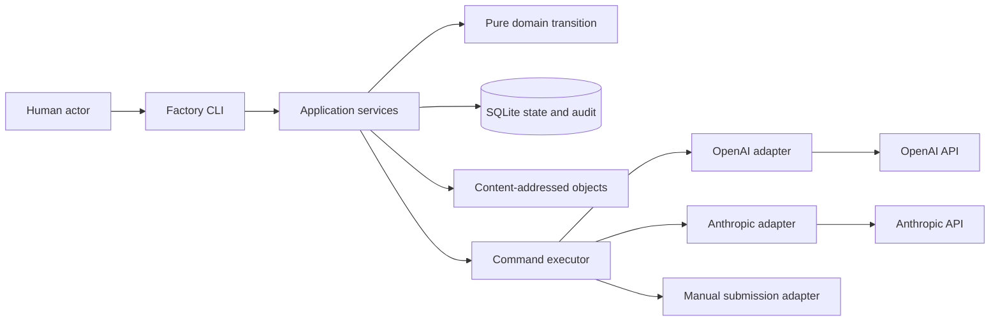
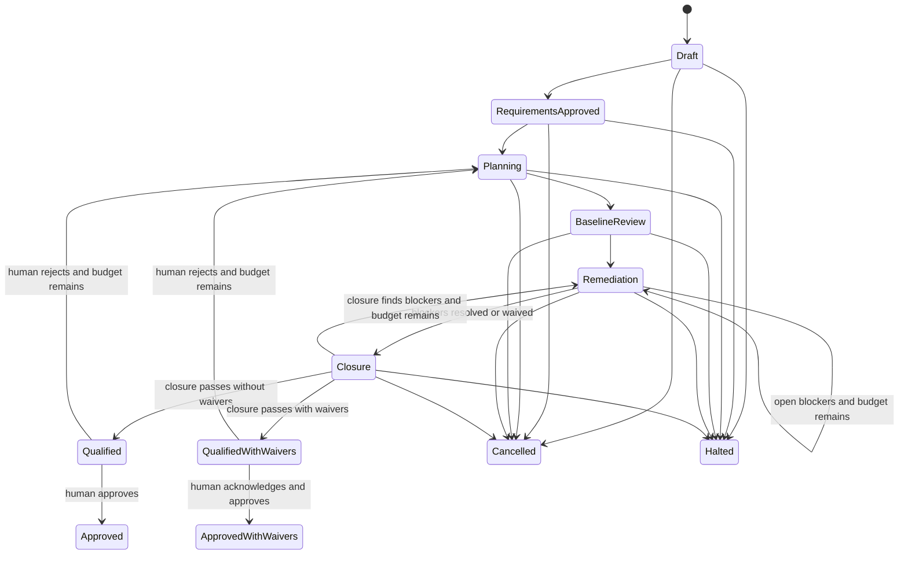

# Software Factory — Milestone 1 Architecture

**Status:** Approved design baseline
**Architecture version:** 2.0
**Input:** Software Factory PRD v2.0
**Scope:** Requirements-to-approved-plan walking skeleton
**Deployment:** Local, single-user command-line application
**Implementation status:** Not started
**Architecture readiness:** Satisfied on 2026-08-18

## 1. Architecture summary

The Software Factory is a modular TypeScript monolith distributed as an npm CLI. It coordinates a deterministic workflow around two nondeterministic provider adapters, persists authoritative state in transactional SQLite tables, stores immutable content in a project-local content-addressed object store, and records every accepted domain transition in a hash-chained audit journal.

The central rule is:

> The pure domain transition decides the next state, commands, and audit facts. The application commits them atomically. Adapters perform effects outside transactions and return evidence as new inputs.

This architecture deliberately does **not** use event sourcing. Audit entries explain accepted state transitions but are not replayed to reconstruct current state. See [ADR 0001](./adr/0001-authoritative-transactional-state.md).

## 2. Architecture drivers

| Driver | Architectural response |
|---|---|
| Honest outcomes | Explicit qualified, approved, halted, and cancelled states |
| Recoverability | Authoritative transactions, durable planned commands, leases, and outcome reconciliation |
| Traceability | Stable IDs, content hashes, lineage, immutable artifacts, and hash-chained audit entries |
| Independent review | Separate configurable OpenAI and Anthropic roles with recorded overrides |
| Bounded execution | Reserved and actual usage ledgers for every retry and substantive loop |
| Reproducibility | Pinned policy/model identity and local strict replay; no deterministic-generation claim |
| Privacy | Project-local storage, minimum provider-side storage, explicit transmission acknowledgment |
| Simplicity | One package, one process, one active run, one effectful command, no server or queue |

## 3. System context



There is no inbound network listener. Only an explicitly executed live provider command may cross the network boundary.

## 4. Codebase shape

Milestone 1 is one package with internal module boundaries:

```text
src/
  cli/             argument parsing, rendering, exit codes
  application/     use cases, transactions, leases, execution coordination
  domain/          state, inputs, transition rules, policies, identities
  infrastructure/
    sqlite/        repositories, migrations, backup, integrity checks
    artifacts/     content-addressed objects and working projections
    providers/     OpenAI, Anthropic, record/replay
    platform/      clock, filesystem permissions, credential references
  reporting/       projections, terminal manifests, exports
  evaluation/      seeded and comparative evaluation harness
schemas/           versioned machine contracts
protocols/         state transitions, commands, audit entries, adapters
config/            versioned default taxonomy, prompts, rubrics, budgets
tests/             unit, integration, crash, replay, and evaluation cases
```

Dependencies point inward:

- `domain` imports no application, infrastructure, filesystem, database, clock, random, environment, or network code.
- `application` depends on domain contracts and infrastructure interfaces.
- `infrastructure` implements interfaces without owning workflow policy.
- `cli`, `reporting`, and `evaluation` invoke public application services.

Separate packages or processes are deferred until a real deployment or reuse boundary appears.

## 5. Domain transition

The domain entry point is conceptually:

```ts
type TransitionResult = {
  nextState: RunState;
  commands: PlannedCommand[];
  auditFacts: AuditFact[];
};

function transition(
  previousState: RunState,
  input: DomainInput,
  policy: PinnedRunPolicy,
): TransitionResult;
```

The function is deterministic. IDs, timestamps, usage, provider request IDs, file hashes, and other nondeterministic values enter through `DomainInput`; the core never creates or reads them implicitly.

The application validates invariants and persists `nextState`, planned commands, and audit entries derived from `auditFacts` in one SQLite transaction. Application code may reject malformed transition output but may not invent workflow decisions.

## 6. Run state machine

The detailed transition table is a required readiness artifact. The high-level lifecycle is:



`Approved`, `ApprovedWithWaivers`, `Halted`, and `Cancelled` are terminal. A child run references parent evidence and records changed conditions. It does not resume or mutate its parent.

A workspace database may contain many terminal runs but enforces at most one nonterminal run.

## 7. Authoritative storage

### 7.1 SQLite responsibilities

SQLite contains authoritative transactional records for:

- workspace and schema metadata;
- runs and resolved configuration;
- requirements and ledger versions;
- plan versions, sections, transitions, and components;
- findings, observations, associations, severity history, and waivers;
- gates and human decisions;
- logical commands, physical attempts, leases, and usage reservations;
- artifact metadata and references;
- audit entries and chain heads; and
- migrations and integrity results.

Reports and views may be rebuilt from authoritative tables, but authoritative state is never rebuilt by replaying audit entries.

### 7.2 Transaction boundary

For an accepted input:

1. Begin an immediate SQLite transaction.
2. Load and version-check authoritative state.
3. Call the pure transition with the input and pinned policy.
4. Validate the returned state, commands, and audit facts.
5. Update authoritative state tables.
6. Insert planned logical commands with deterministic keys.
7. Append hash-chained audit entries.
8. Advance the run state version and chain head.
9. Commit.

Any failure rolls back the entire accepted transition. No provider call, object write, backup, or slow render occurs inside this transaction.

### 7.3 Optimistic state version

Every run carries a monotonic `state_version`. Inputs declare the version they observed. A stale mutation fails before transition, preventing a delayed adapter result or duplicate CLI action from overwriting newer state.

Wall-clock timestamps are evidence metadata only. State version, journal sequence, causation, and correlation establish ordering.

## 8. Audit journal

An audit entry records:

```ts
interface AuditEntry {
  sequence: number;
  runId: string;
  stateVersionBefore: number;
  stateVersionAfter: number;
  factType: string;
  schemaVersion: number;
  actor: ActorReference;
  reason?: string;
  evidenceRefs: ArtifactReference[];
  causationId?: string;
  correlationId?: string;
  recordedAt: string;
  previousEntryHash: string;
  entryHash: string;
}
```

The entry hash covers the canonical serialized entry excluding `entryHash`. Verification runs before mutation and on demand. A broken chain, missing sequence, or state-version mismatch moves the workspace into read-only diagnostic mode. The CLI permits inspection and export but never automatically repairs or rewrites history.

Hash chaining detects accidental or casual modification; it does not claim protection against a malicious administrator who controls the database and application.

## 9. Commands, attempts, and leases

### 9.1 Logical command

A logical command represents one intended external action. Its deterministic key includes:

- run ID;
- command type and schema version;
- triggering state version;
- canonical input artifact hashes;
- pinned policy, prompt, schema, rubric, provider, and model identities; and
- purpose-specific identity such as review cycle or finding set.

A uniqueness constraint prevents duplicate logical commands for the same transition.

### 9.2 Physical attempt

Each execution creates a physical attempt tied to one logical command. Attempts record start and completion state, application correlation ID, provider request and response IDs when known, native usage, artifact references, and failure classification.

At most one logical result may be accepted. Every physical call and charge remains recorded and budgeted even when its result is discarded or duplicated.

### 9.3 Mutation lease

A project-level logical mutation lease protects execution across a provider call without holding an SQLite write transaction. The lease records owner, command, acquired time, heartbeat, and recovery state.

Read-only commands use independent SQLite connections while the lease is held. Another mutation may not start. Recovery never assumes that an expired lease means a provider call did not occur.

### 9.4 Unknown outcome recovery

If a process dies after dispatch but before recording a response:

1. Recovery marks the attempt outcome unknown.
2. It checks local recordings and provider evidence where available.
3. If no accepted result exists, it may retry with the same application correlation key.
4. It warns that neither initial synchronous provider guarantees general idempotency.
5. It records possible duplicate generation and billing.
6. It accepts the first valid result committed against the expected state version and discards later results as evidence.

## 10. Artifact architecture

### 10.1 Object storage

Immutable bodies live under `.factory/objects/` by cryptographic content hash. Artifact metadata records media type, schema version, byte length, provenance, creator, source path when applicable, and hash.

Per [ADR 0003](./adr/0003-stage-artifacts-before-state.md), the write protocol is:

1. Write to a temporary file in the object-store filesystem.
2. Flush, hash, and verify the exact bytes.
3. Atomically rename to the content-addressed destination.
4. Commit the artifact reference and related transition in SQLite.

A crash before step 4 may leave an unreferenced object. A crash after step 4 cannot leave authoritative state pointing at a body that was never finalized.

### 10.2 Canonical and rendered plans

Versioned structured JSON is canonical. The deterministic renderer emits Markdown with visible or machine-readable stable anchors owned by the orchestrator.

Before dependent work, the application verifies the working projection hash. A mismatch is registered as an external-edit artifact and blocks progression. The edit is never silently overwritten or parsed back into canonical state.

A human canonical submission includes existing section IDs and an explicit transition map. Validation rejects silent ID loss, ID reuse, or an unexplained split, merge, retirement, or new section.

### 10.3 Source and ledger artifacts

Raw requirements are copied once from the external path into the object store. The approved ledger, not the external file or raw artifact, is normative for planning and review.

Ledger JSON is canonical. Markdown review views and coverage reports are deterministic projections. Each relevant raw-source span must map to an active requirement or a human-approved source exclusion.

## 11. Requirements and section lineage

Stable requirement identity is independent of display numbering and prose. Lifecycle operations support update, removal, replacement, split, and merge. Successors preserve lineage roots.

When an approved ledger changes:

- renewed human approval is required;
- downstream plans, review gates, and qualification become stale;
- historical artifacts and findings remain immutable;
- associations remap mechanically only where lineage is unambiguous; and
- ambiguous or orphaned blocking findings require human disposition.

Changed raw source starts a child run rather than a new ledger version.

## 12. Findings architecture

### 12.1 Identity

Finding IDs assigned by the orchestrator are authoritative. A controlled fingerprint may include taxonomy rule, category, requirement-lineage roots, component ID, and other schema-controlled discriminators. It produces reconciliation candidates only.

Equal fingerprints never silently merge findings. See [ADR 0002](./adr/0002-authoritative-finding-identity.md).

### 12.2 Observations

Every review creates observations tied to exact plan, ledger, policy, model, prompt, and cycle identities. An observation contains Reviewer disposition, severity, evidence references, affected stable IDs, and normalized rule fields.

The Reviewer receives all relevant unresolved and superseded-pending finding IDs. It must account for them explicitly and may report new concerns without IDs.

### 12.3 Authority

| Actor | Allowed authority |
|---|---|
| Planner | Propose plan changes and remediation evidence |
| Reviewer | Evaluate observations and remediation substance |
| Orchestrator | Assign IDs and apply policy-defined lifecycle transitions |
| Human | Approve exclusions, waive risk, resolve ambiguity, override independence, reject, approve |

Planner claims never close findings. Reviewer output never directly mutates the ledger. Human waiver never changes a concern to resolved.

### 12.4 Waiver invalidation

A waiver references the exact finding, plan, requirement associations, evidence, and policy versions it accepts. Any relevant change marks it stale. A stale waiver blocks qualification until reaffirmed or removed.

## 13. Review protocol

### 13.1 Baseline

The Reviewer evaluates the complete canonical plan against the approved ledger and pinned review policy. It returns schema-constrained observations. Deterministic validation checks schema, controlled IDs, full prior-finding accounting, and evidence references before accepting the result.

### 13.2 Remediation

For each blocking finding, the Planner returns a revised structured plan, a complete section transition map, the finding IDs addressed, and evidence. The application computes deterministic diffs and hash comparisons, then asks the Reviewer to verify substance.

An unchanged claimed section is evidence, not automatic failure, because a valid repair may occur elsewhere.

### 13.3 Closure

After all blockers are resolved or waived, the Reviewer performs a new full-document review. New blocking findings reopen remediation only while the independent closure and remediation budgets permit. Exhaustion halts.

### 13.4 Human gate

Closure success creates `qualified` or `qualified_with_waivers`. Approval requires a consequential CLI action attributed to the configured human actor and OS account metadata. Approval with waivers displays and separately acknowledges every unresolved accepted risk.

Rejection records a reason and returns to planning if existing run bounds permit.

## 14. Failure and budget policy

Failure classes are data, not adapter-specific control flow:

| Class | Handling |
|---|---|
| Deterministic validation | Stop for corrected input |
| Transient transport | Bounded retry with backoff |
| Unknown external outcome | Recovery reconciliation, possible repeated call |
| Schema invalid | Separately bounded repair attempts |
| Provider refusal | Stop or policy-directed human action; no blind repair |
| Output truncation | Limit/budget handling; no blind repair |
| Substantive finding | Remediation workflow |
| Closure failure | Closure policy and its independent bound |
| Integrity failure | Read-only diagnostic mode |

The resolved run configuration stores independent hard ceilings for provider calls, physical attempts, schema repairs, remediation cycles, closure cycles, tokens, and money. Before dispatch, the application reserves the maximum allowed usage for the next command or refuses to start it. Completion reconciles reservation against provider-native usage.

Conservative defaults are generated at initialization but cannot authorize a first live call until explicitly accepted. Ceilings may be reduced during a run; increases require a child run.

## 15. Provider architecture

### 15.1 Common contract

```ts
interface ProviderAdapter {
  execute(request: ProviderRequest): Promise<ProviderResult>;
}

type ProviderResult =
  | { kind: "completed"; response: unknown; evidence: ProviderEvidence }
  | { kind: "refused"; evidence: ProviderEvidence }
  | { kind: "truncated"; evidence: ProviderEvidence }
  | { kind: "transport_failure"; retryable: boolean; evidence: ProviderEvidence }
  | { kind: "unknown_outcome"; evidence: ProviderEvidence };
```

The common request includes exact model ID, endpoint and behavior-affecting options, schema, messages, application correlation ID, storage preference, timeout, and recording mode.

Evidence preserves normalized and raw request, endpoint/API version and relevant headers, requested and returned model, provider response ID, HTTP request ID, provider-native usage, completion/refusal status, and raw response. Secrets are excluded before persistence.

### 15.2 OpenAI and Anthropic

Both adapters support schema-constrained output, pinned/canonical model identity, request correlation, native usage capture, and local recording. Provider-specific refusal, truncation, schema-subset, and usage fields remain available rather than being flattened away.

No generic synchronous-call idempotency guarantee is assumed. OpenAI client request IDs and provider response IDs, and Anthropic request IDs, are correlation evidence rather than deduplication guarantees.

Role assignment is configuration, not code. Default policy requires Planner and Reviewer to use different providers and models from the frontier allowlist. A run-level human override remains explicit and reportable.

### 15.3 Pinning

The run records the exact requested and returned model identity. A pinned identity constrains the declared model version but does not promise byte-identical regeneration. Unavailable pinned models halt; no floating alias substitution occurs.

## 16. Record, replay, and rerun

Recordings live under `.factory/cassettes/` and are Git-ignored. A recording identity includes the logical command key plus exact normalized request and policy hashes.

- **Record mode:** performs a live call and atomically stores request/response evidence as artifacts before accepting the result.
- **Strict replay:** returns the exact matching local recording and never calls the network; a miss returns `UNRECORDED_REQUEST`.
- **Rerun:** deliberately bypasses an accepted recording, performs a fresh physical call, records an auditable human request, and consumes budget.

Strict replay is exposed to users and reused by automated tests and evaluation. It reproduces the recorded result, not provider generation.

## 17. Configuration and policy identity

Effective configuration resolves in this order:

1. Versioned built-in defaults
2. Project configuration
3. Explicit CLI overrides

Environment variables and credential-store lookups supply secret values only. They never silently change policy, models, or budgets.

The run persists the fully resolved non-secret configuration and content hashes for taxonomy, prompts, schemas, rubrics, allowlists, and model choices. It may be corrected audibly before the first provider-backed command. After that boundary, policy changes require a child run.

## 18. Security and privacy

### 18.1 Local storage

The initializer applies restrictive permissions and Git-ignore rules to `.factory/`. The product relies on OS account and filesystem protection and explicitly does not promise built-in encryption at rest.

Normal commands never delete immutable history. Cleanup reports unreferenced objects; explicit confirmed purge may delete only verified unreferenced objects or an entire terminal run and reports what was removed.

### 18.2 Credentials

Credential values may exist only in process memory after environment or OS credential-store resolution. They are prohibited from configuration snapshots, SQLite, artifacts, cassettes, logs, errors, and exports. Redaction tests cover known provider formats and authorization headers.

### 18.3 Provider transmission

Before the first live run, the CLI displays and records acknowledgment of the configured provider boundary. It minimizes provider-side storage where supported and discloses unavoidable provider retention. Optional SDK telemetry is disabled by default.

Local-first means local operational ownership, not offline-only or zero external retention.

### 18.4 Untrusted content

Raw requirements, ledgers, plans, review text, and provider output are untrusted data. Prompt construction separates instructions, schemas, and artifact content. Model text cannot authorize shell execution, filesystem mutation outside artifact protocols, credential access, or network destinations.

## 19. Migrations, backup, and integrity

Numbered migrations run only after:

1. SQLite integrity checks pass.
2. The audit chain verifies.
3. A backup copy of SQLite is created.
4. A manifest of every referenced object hash is written and verified.

Schema changes execute transactionally. A CLI older than the database schema refuses mutation. Historical artifacts and audit entries are never rewritten to simulate a new schema; adapters and readers use explicit version conversion where needed.

Restore verifies SQLite, chain integrity, schema compatibility, and every referenced object before clearing read-only mode.

## 20. CLI architecture

The CLI is a thin application client. Every command supports stable exit-code classes and `--json`; default output is human-readable.

Suggested command groups:

```text
factory init | config
factory run start | list | status | child | cancel
factory requirements submit | validate | approve | exclude
factory plan generate | submit | render | reject | approve
factory review next | findings | waive | reconcile
factory command retry | rerun | replay
factory inspect state | audit | artifacts | usage | gates
factory export report | manifest | plan
factory doctor | backup | migrate | cleanup | purge
```

Exact executable and command spelling remain a readiness decision. Command behavior, JSON schemas, and exit-code classes are versioned public contracts.

## 21. Reporting

Read models serve status, findings, usage, gates, artifacts, and audit inspection from authoritative SQLite state. They do not require the mutation lease.

Every terminal outcome emits:

- a human-readable Markdown report; and
- a machine-readable manifest containing input and artifact hashes, policy identity, providers and models, physical and logical usage, gate evidence, findings, waivers, actors, decisions, lineage, and outcome.

Approved outcomes additionally export the accepted structured plan and rendered Markdown. Halted and cancelled outcomes explain the stopping condition, remaining unresolved work, possible duplicate calls, and safe child-run options.

## 22. Evaluation architecture

The evaluation harness invokes public application interfaces against isolated workspaces. It is not a production state-machine stage.

It contains:

- seeded source and ledger cases with planted defects and non-defects;
- computable expected classifications and severity bands;
- strict-replay fixtures for deterministic protocol tests;
- live evaluation mode with pinned policies and models;
- blinded baseline/factory plan pairs; and
- the versioned human scoring rubric.

Evaluation output records corpus, policy, models, prompts, provider-native usage, scorers, raw scores, thresholds, and pass/fail result.

## 23. Testing strategy

### Pure transition tests

Table-driven tests cover every allowed and rejected state transition, stale version, invalidation, gate, budget reservation, waiver, finding reconciliation, and terminal condition without I/O.

### Transaction tests

Tests prove state, commands, and audit entries commit or roll back together; uniqueness constraints reject duplicates; and read models never become authoritative.

### Crash tests

The process is terminated before and after object finalize, state commit, lease acquisition, provider dispatch, recording persistence, result acceptance, cancellation, backup, and migration. Each restart must produce an explainable state and at most one accepted logical result.

### Provider contract tests

Fixtures cover successful structured output, refusal, truncation, schema violation, timeout, unknown outcome, request correlation, native usage, unavailable pinned model, recording miss, and storage preference.

### Identity tests

Tests cover requirement split/merge/removal, section transition maps, fingerprint collisions, ambiguous reconciliation, orphan blockers, waiver invalidation, and external Markdown edits.

### Security tests

Tests verify secret exclusion, Git-ignore initialization, restrictive permissions, prompt/content separation, telemetry defaults, provider-storage preferences, purge safeguards, and terminal-manifest redaction.

### Performance tests

Supported-workload inspection and local transitions target p95 below 500 ms excluding provider latency.

## 24. Delivery increments

### Increment 1 — Baseline-reviewed vertical slice

Implement initialization, source and ledger registration, coverage approval, canonical plan generation, rendering, one OpenAI and one Anthropic path, baseline review, transactional state, artifacts, audit entries, inspection, and provisional export.

### Increment 2 — Qualification and approval

Implement finding identity and observations, reconciliation, remediation claims, independent verification, closure, waivers, rejection, approval, and terminal manifests.

### Increment 3 — Recovery and security hardening

Implement leases, attempt recovery, unknown outcomes, cancellation, child runs, chain verification, read-only diagnostics, migration backup, provider acknowledgment, permissions, and explicit purge.

### Increment 4 — Replay and evaluation

Implement strict replay, rerun, seeded and live evaluation, blinded scoring, and milestone acceptance reporting.

Automated requirements normalization moves to a later milestone.

## 25. Architecture readiness

The architecture-readiness gate is satisfied by these executable design artifacts:

- [State transitions](../protocols/state-transitions.md)
- [Commands](../protocols/commands.md)
- [Audit entries](../protocols/audit-entries.md)
- [Provider contracts](../protocols/providers.md)
- [Versioned schemas](../schemas/)
- [Review policy assets](../config/)
- [Database schema](../database/schema.v1.sql) and [migration protocol](../database/MIGRATIONS.md)
- [Acceptance-test matrix](./ACCEPTANCE-TEST-MATRIX.md)

Exact initial model IDs, budget values, executable name, and package identity are recorded in versioned configuration rather than hardcoded in application policy. Implementation may now begin with Increment 1.

## 26. Decision records

- [ADR 0001 — Authoritative transactional state](./adr/0001-authoritative-transactional-state.md)
- [ADR 0002 — Authoritative finding identity](./adr/0002-authoritative-finding-identity.md)
- [ADR 0003 — Stage artifacts before state](./adr/0003-stage-artifacts-before-state.md)

Future ADRs are added only for decisions that are costly to reverse, surprising without context, and selected through a real trade-off.

## 27. Document authority

The PRD governs product behavior and externally meaningful guarantees. This document explains implementation mechanisms. When they conflict, implementation is blocked until architecture conforms or an explicit PRD change is accepted.
